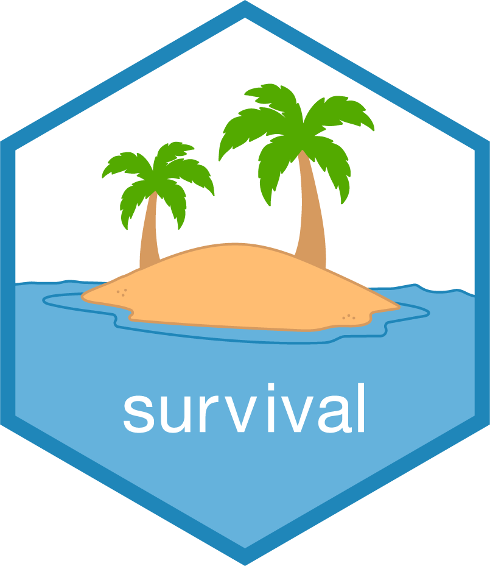

# survival

This is the source code for the "survival" package in R.  It gets posted to the
comprehensive R archive (CRAN) at intervals, each such posting preceded a
throrough test. (I run the test suite for all 500+ packages that depend on
survival.)  In general, each new push to CRAN will update the second term of
the version number, e.g. 2.40-5 to 2.41-0.  Updates only to the github source
increment after the dash.  (If an error is found in the process of CRAN
submission then the published CRAN version may be x.yy-1 or even x.yy-2.) 

The vignette "tutorial.Rnw" is not posted to CRAN, since it requires data from
the mstate package, survival is a recommended package, and such packages can 
only depend on other recommended packages.  (This allows for a consistent 
distribution bundle.)  It is included here in the vignette2 directory.  

A large portion of the source is found in the noweb directory, and is based on
the literate programming ideas of Knuth. The reason is that it allows more
complete documentation of the methods. I can have things like blocks of
equations, and find having the "real" equations side by side with the code makes
it much easier to get it right.  Anyone who wants to study the methods is advised
to perform "make code.pdf" in the noweb directory and then look at the relevant
portion of that pdf file.  

You should be able to install this using the following R code:
> library(noweb)   # noweb is needed by the make process, library() just checks
>                  # that you have it available -- you can leave this line out
> library(devtools)
> install_git("git://github.com/therneau/survival.git")

However, this may not work on all configurations.

 1. The "configure" file is a shell script that runs "make fun" in the noweb
directory. This will populate the R and src directories with a number of files
whose first line is
   # Automatically generated from the noweb directory
The noweb/Makefile may not be appropriate for all systems as I only
test on linux.  There should also be a configure.win file, but I never use
MS-Windows so have not the tools to create and test it.  This is an area where
contributions to make the process more universal would be welcome.
 2. Before submission to CRAN, I run the make process myself and then
remove the configure file.  This ensures that the package as downloaded from
CRAN works on all architectures.

An alternate is to clone the source to your own machine, execute the "make"
process by hand, and then install from that source.
